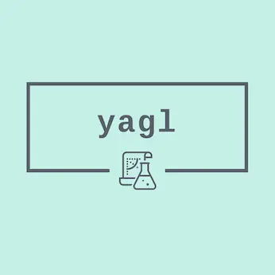

# yagl aka Yet Another GitHub Labeler

<center> </img> </center>

There are bazilion libraries and CLIs that create labels in GitHub repositories. After 1h research I got tired, didn't found what I need, so created this one.

## What it does

Yagl creates a label in all repositories of a given organization.

## What it uses

Yagl uses only GitHub's GraphQL API.

## Why I needed it

To prepare AsyncAPI organization for amazing [Hacktoberfest](https://hacktoberfest.digitalocean.com) and create required label in all, over 35 repos.

## How to use it

1. Clone and install
    ```bash
    git clone https://github.com/derberg/yagl
    cd yagl
    npm install
    ```
2. Familiarize with possible environment variables that you can pass to the application

    Environment variable | Example value | Default | Comment
    --- | --- | --- | ---
    GITHUB_TOKEN | xxx | | Create such a token with `repo` scope using [this](https://docs.github.com/en/github/authenticating-to-github/creating-a-personal-access-token) instruction.
    ORG_NAME | asyncapi | | 
    COLOR | FF8AE2 | FF8AE2 | Do not put `#` in this value.
    LABEL | Hacktoberfest | Hacktoberfest | 
    DESCRIPTION | "Label issues as available for participants of https://hacktoberfest.digitalocean.com" | | 
3. Run the app
    ```bash
    # export token separately once so later by accident you do not show it to anyone
    export GITHUB_TOKEN=xxx
    ORG_NAME=asyncapi COLOR=FF8AE2 LABEL=Hacktoberfest DESCRIPTION="Label issues as available for participants of https://hacktoberfest.digitalocean.com" npm run start
    ```

